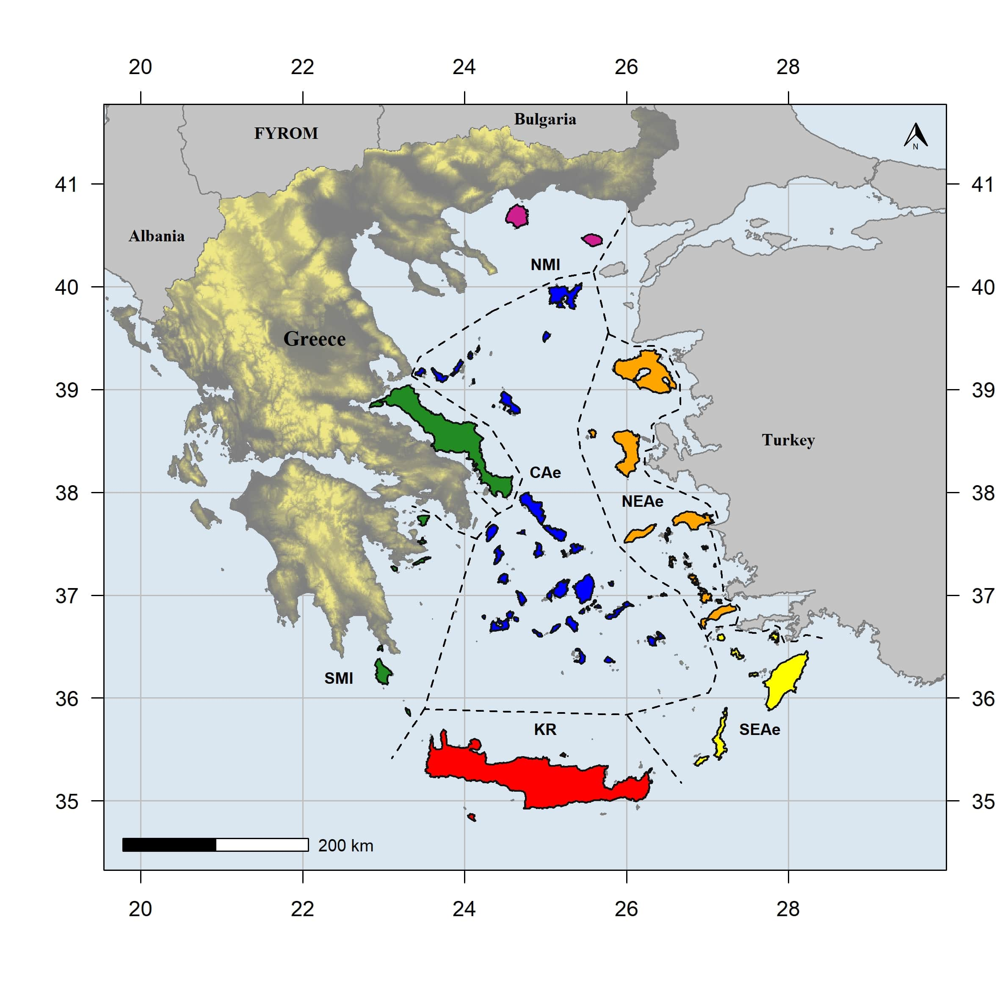

+++
# Project title.
title = "Aegean biogeography"

# Date this page was created.
date = 2019-01-09T00:00:00

# Project summary to display on homepage.
summary = "The Aegean archipelago is one of the largest archipelagos in the world and has long fascinated biogeographers due to its high environmental heterogeneity, complex palaeogeography, high diversity and endemism."

# Tags: can be used for filtering projects.
# Example: `tags = ["machine-learning", "deep-learning"]`
tags = ["Aegean", "Biogeography", "Greece", "Greuter", "Rechinger", "Runemark", "Snogerup", "Strid", "UPA"]

# Optional external URL for project (replaces project detail page).
external_link = ""

# Slides (optional).
#   Associate this project with Markdown slides.
#   Simply enter your slide deck's filename without extension.
#   E.g. `slides = "example-slides"` references 
#   `content/slides/example-slides.md`.
#   Otherwise, set `slides = ""`.
slides = ""

# Links (optional).
url_pdf = ""
url_slides = ""
url_video = ""
url_code = ""

# Custom links (optional).
#   Uncomment line below to enable. For multiple links, use the form `[{...}, {...}, {...}]`.
url_custom = [{icon_pack = "ai", icon="google-scholar", name = "Dr. Kostas Kougioumoutzis", url = "https://scholar.google.gr/citations?user=CceadYwAAAAJ&hl=en"},
{icon_pack = "ai", icon="google-scholar", name = "Ass. Prof. Kostas A. Triantis", url = "https://scholar.google.gr/citations?user=jTzQHXwAAAAJ&hl=en&oi=ao"},
{icon_pack = "ai", icon="researchgate", name = "Ass. Prof. Panayiotis Trigas", url = "https://www.researchgate.net/profile/Panayiotis_Trigas2"},
{icon_pack = "ai", icon="google-scholar", name = "Ass. Prof. Maria Panitsa", url = "https://scholar.google.gr/citations?user=JLeOBm0AAAAJ&hl=en&oi=sra"},
{icon_pack = "ai", icon="researchgate", name = "Ass. Prof. Argyro Tiniakou", url = "https://www.researchgate.net/profile/Argyro_Tiniakou"},
{icon_pack = "ai", icon="google-scholar", name = "Dr. Stylianos M. Simaiakis", url = "https://scholar.google.gr/citations?user=SxUqkaYAAAAJ&hl=en&oi=sra"},
{icon_pack = "ai", icon="researchgate", name = "Dr. Elisavet Georgopoulou", url = "https://www.researchgate.net/profile/Elisavet_Georgopoulou"},
{icon_pack = "ai", icon="researchgate", name = "Anna Th. Valli", url = "https://www.researchgate.net/profile/Anna_Thalassini_Valli2"},
{icon_pack = "ai", icon="researchgate", name = "Dr. Anna Kagiampaki", url = "https://www.researchgate.net/profile/Anna_Kagiampaki2"}]

# Featured image
# To use, add an image named `featured.jpg/png` to your project's folder. 
[image]
  # Caption (optional)
  caption = "By NASA, Public Domain, https://commons.wikimedia.org/w/index.php?curid=37379"
  
  # Focal point (optional)
  # Options: Smart, Center, TopLeft, Top, TopRight, Left, Right, BottomLeft, Bottom, BottomRight
  focal_point = "Smart"
+++

## The pioneers
The modern botanical exploration of the Aegean Islands dates back to the late 18th century. The substantial plant distribution data collected by pioneer botanists working in the Aegean enabled Turrill in 1929 to first divide the area in six phytogeographical regions. Nearly two decades later, Karl-Heinz Rechinger from the Natural History Museum of Vienna based on his extensive plant collections first addressed the phytogeographical peculiarities of the Aegean (e.g., Kykladenfenster, i.e., the absence of several taxa from the Central Aegean that are present in the Greek mainland and in the East Aegean Islands).  
  
Both Turill and Rechinger noticed the abrupt phytogeographical differences between the Kiklades and the East Aegean Islands, drew the phytogeographical line dividing Asia from Europe (i.e. Rechinger’s line) and laid the foundations of the Aegean’s prevailing phytogeographical subdivision. 
Half a century later, Strid & Tan divided the Aegean into five biogeographical regions; this subdivision was essentially a practical one and it is widely accepted and used in most of the floristic and phytogeographical studies.  
  
## Recent advances  
Building upon the aforementioned phytogeographical subdivision, [Kougioumoutzis et al. (2017)](https://onlinelibrary.wiley.com/doi/abs/10.1111/jbi.12920) presented the most recent biogeographical classification of the Aegean archipelago. Via a network optimization approach, six large highly linked subgroups of islands and plant taxa (biogeographical modules) were identified in the Aegean (see the figure below).  
   
  
      
The northernmost module (NMI) consists of Thasos and Samothraki together with north mainland Greece (NE). In module SMI, Evvia and the western part of South Aegean island arc are grouped together with the southern parts of mainland Greece (Peloponnese: Pe, and Sterea Hellas: StE). Ιn the Central Aegean module (CAE), the Kiklades are grouped together with Northern Sporades and Limnos. North-Eastern Aegean module (NE-AE) extends from Lesvos to Kos. The Southeast Aegean module (SE-AE) is formed by the complexes of Rhodos, Karpathos, Nisyros, Tilos, Symi and Chalki and Crete is a separated phytogeographical region (KR).  
  
## Division-makers    
The delimitation of these six Aegean biogeographical regions is in almost complete harmony with the archipelago’s palaeogeographical evolution from the middle Miocene to the end of the Pleistocene (see the figure below). 
  
   
  
The biogeographical barriers of the mid-Aegean trench and the North Aegean trough seem to have influenced plant distribution patterns and the phytogeographical subdivision of the Aegean, both locally and regionally, is similar to the Aegean’s past and contemporary climatic differentiation.    
  
   
  
